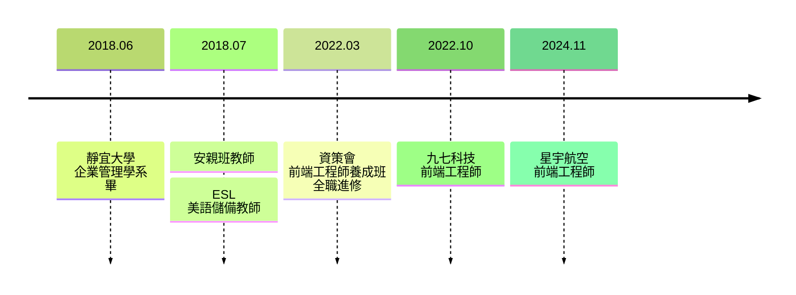

<h1 class="text-left">經歷簡介</h1>

<!-- https://mermaid.js.org/intro/ -->

  <a
    href="https://www.cake.me/s--IsMtR91vysbvX0UyAygejA--/han"
    target="_blank"
    class="slidev-icon-btn"
  >
    <carbon:result />
  </a>

<!-- https://sli.dev/guide/animations.html#click-animation -->
<!-- 

Here!
 -->

